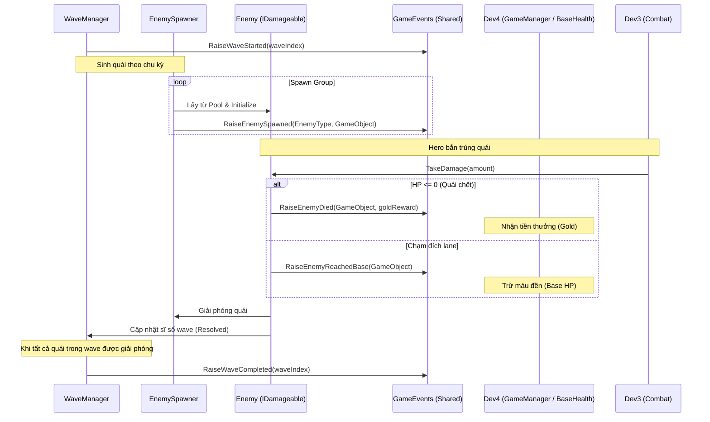

# BÁO CÁO NGHIỆM THU HOÀN THÀNH NHIỆM VỤ DEV2 (ENEMY / WAVE SYSTEM)
**Dự án:** Hồn Việt Thủ Thành (Unity 3D)  
**Giai đoạn:** Phase 1 (Core Prototype) & Giai đoạn 2 (Core Gameplay Stats/Waves)  
**Tác giả:** Antigravity Agent  
**Trạng thái:** **HOÀN THÀNH 100% (DONE)**

---

## 1. Tóm tắt Trạng thái (Completion Status)
Toàn bộ các yêu cầu của module **Dev2 - Enemy / Wave System** đã được triển khai hoàn chỉnh, tự đóng gói trong thư mục `Assets/Project/Dev2_EnemyWave/` và giao tiếp thông qua hệ thống Event dùng chung trong `Assets/Project/Shared/`. 

Dưới đây là bảng đối chiếu chi tiết giữa yêu cầu đề ra và thực tế triển khai:

| Yêu cầu nhiệm vụ Dev2 | Trạng thái | Minh chứng thực tế (File / Object / Script) |
| :--- | :---: | :--- |
| **1. Enemy Prefab & HP** | **DONE** | [Enemy_Prototype.prefab](file:///d:/FPTU/Semester7/PRU213/Product_Project/hon-viet-thu-thanh/Assets/Project/Dev2_EnemyWave/Prefabs/Enemy_Prototype.prefab) chứa Component `Enemy` và `EnemyMover`. |
| **2. HP & Sát thương (Damageable)** | **DONE** | Script [Enemy.cs](file:///d:/FPTU/Semester7/PRU213/Product_Project/hon-viet-thu-thanh/Assets/Project/Dev2_EnemyWave/Scripts/Enemy.cs) implement interface `IDamageable` và `ITargetable`. |
| **3. Di chuyển theo Path/Lane** | **DONE** | Script [EnemyMover.cs](file:///d:/FPTU/Semester7/PRU213/Product_Project/hon-viet-thu-thanh/Assets/Project/Dev2_EnemyWave/Scripts/EnemyMover.cs) và [LanePath.cs](file:///d:/FPTU/Semester7/PRU213/Product_Project/hon-viet-thu-thanh/Assets/Project/Dev2_EnemyWave/Scripts/LanePath.cs) điều khiển di chuyển qua waypoints. |
| **4. EnemySpawner** | **DONE** | Script [EnemySpawner.cs](file:///d:/FPTU/Semester7/PRU213/Product_Project/hon-viet-thu-thanh/Assets/Project/Dev2_EnemyWave/Scripts/EnemySpawner.cs) quản lý spawn ngẫu nhiên trên các Lane và quản lý pooling qua `EnemyPool`. |
| **5. WaveManager (3 Waves)** | **DONE** | Script [WaveManager.cs](file:///d:/FPTU/Semester7/PRU213/Product_Project/hon-viet-thu-thanh/Assets/Project/Dev2_EnemyWave/Scripts/WaveManager.cs) được cấu hình 3 wave chính thức trên scene. |
| **6. Sự kiện OnEnemyDied** | **DONE** | Bắn thông qua `GameEvents.RaiseEnemyDied` khi HP về 0. |
| **7. Sự kiện OnEnemyReachedBase** | **DONE** | Bắn thông qua `GameEvents.RaiseEnemyReachedBase` khi chạm cuối Lane. |
| **8. Các sự kiện Spawned/Wave** | **DONE** | Tích hợp đầy đủ `OnEnemySpawned`, `OnWaveStarted`, `OnWaveCompleted`. |

---

## 2. Chi tiết Kỹ thuật & Minh chứng cụ thể (Code & Asset Evidence)

### 2.1. Quản lý Chỉ số Lính (Enemy Stats ScriptableObject)
Các chỉ số máu (HP), tốc độ (Move Speed), tiền thưởng (Gold Reward), và sát thương đền (Damage to Base) được quản lý tập trung bằng Asset thông qua lớp [EnemyData.cs](file:///d:/FPTU/Semester7/PRU213/Product_Project/hon-viet-thu-thanh/Assets/Project/Shared/Data/EnemyData.cs).
Đã tạo sẵn 3 loại Enemy thực tế:
1. **Lính Xâm Lược:** [EnemyData_LinhXamLuoc.asset](file:///d:/FPTU/Semester7/PRU213/Product_Project/hon-viet-thu-thanh/Assets/Project/Shared/Data/Enemies/EnemyData_LinhXamLuoc.asset)
   * `Max Health`: 20
   * `Move Speed`: 2.5
   * `Gold Reward`: 10
   * `Damage to Base`: 10
2. **Xe Thiết Giáp:** [EnemyData_XeThietGiap.asset](file:///d:/FPTU/Semester7/PRU213/Product_Project/hon-viet-thu-thanh/Assets/Project/Shared/Data/Enemies/EnemyData_XeThietGiap.asset)
   * `Max Health`: 60
   * `Move Speed`: 1.5
   * `Gold Reward`: 30
   * `Damage to Base`: 20
3. **Tướng Địch (Boss):** [EnemyData_Boss.asset](file:///d:/FPTU/Semester7/PRU213/Product_Project/hon-viet-thu-thanh/Assets/Project/Shared/Data/Enemies/EnemyData_Boss.asset)
   * `Max Health`: 250
   * `Move Speed`: 1.0
   * `Gold Reward`: 100
   * `Damage to Base`: 50

### 2.2. Enemy Prefab & Cơ chế Nhận Sát Thương
* **Prefab:** [Enemy_Prototype.prefab](file:///d:/FPTU/Semester7/PRU213/Product_Project/hon-viet-thu-thanh/Assets/Project/Dev2_EnemyWave/Prefabs/Enemy_Prototype.prefab) chứa Box Collider và Renderer phục vụ raycast/va chạm từ đạn.
* **Script:** [Enemy.cs](file:///d:/FPTU/Semester7/PRU213/Product_Project/hon-viet-thu-thanh/Assets/Project/Dev2_EnemyWave/Scripts/Enemy.cs)
  * Kế thừa `IDamageable` từ shared contract để Dev3 gọi `TakeDamage(float amount)`.
  * Kế thừa `ITargetable` cung cấp `GetPosition()` và `IsAlive()` để Dev3 quét mục tiêu trong tầm bắn.
  * Tích hợp hiệu ứng flash nhấp nháy đỏ khi nhận sát thương qua `TriggerFlash()`.
  * Tự giải phóng về pool khi chết hoặc chạm thành thông qua phương thức `ReleaseSelf()`.

### 2.3. Logic Di chuyển & Thiết lập Path
* **Script:** [EnemyMover.cs](file:///d:/FPTU/Semester7/PRU213/Product_Project/hon-viet-thu-thanh/Assets/Project/Dev2_EnemyWave/Scripts/EnemyMover.cs) điều khiển di chuyển vật lý dọc theo path waypoint bằng `Vector3.MoveTowards()`, kết hợp `Quaternion.Slerp` để xoay hướng mượt mà theo hướng đi.
* **Đường đi:** [LanePath.cs](file:///d:/FPTU/Semester7/PRU213/Product_Project/hon-viet-thu-thanh/Assets/Project/Dev2_EnemyWave/Scripts/LanePath.cs) gom toạ độ start và waypoints thành một mảng liên kết có hỗ trợ vẽ Gizmo trong Editor.

### 2.4. Cấu hình 3 Wave Chính Thức trong Scene
Cấu hình wave được thiết lập trực quan trên component `WaveManager` trong [Scene_Dev2_EnemyWave.unity](file:///d:/FPTU/Semester7/PRU213/Product_Project/hon-viet-thu-thanh/Assets/Project/Dev2_EnemyWave/Scenes/Scene_Dev2_EnemyWave.unity):
* **Wave 1:** 5 Lính Xâm Lược (Spawn interval: 1.25 giây).
* **Wave 2:** 8 Lính Xâm Lược (Interval: 1 giây) + 1 Xe Thiết Giáp (Interval: 2 giây).
* **Wave 3:** 10 Lính Xâm Lược (Interval: 0.8 giây) + 2 Xe Thiết Giáp (Interval: 1.5 giây) + 1 Tướng Địch/Boss (Interval: 3 giây).

---

## 3. Bản đồ Luồng Sự kiện (Event Flow Map)

Các sự kiện được bắn đồng bộ qua [GameEvents.cs](file:///d:/FPTU/Semester7/PRU213/Product_Project/hon-viet-thu-thanh/Assets/Project/Shared/Events/GameEvents.cs):

---

## 4. Công cụ Kiểm thử Cô lập (Isolation Test Tools)
Dev2 đã thiết lập sẵn component `EnemyWaveDebugInput` hỗ trợ test trực tiếp bằng bàn phím (sử dụng New Input System) trong prototype scene:
* **Phím `Space`:** Spawn nhanh 1 enemy để test.
* **Phím `K`:** Tác dụng một lực sát thương thử nghiệm (5 damage) lên enemy đầu tiên còn sống để test cơ chế trừ máu, hiệu ứng flash đỏ, và cái chết.
* **Phím `N`:** Gọi Wave tiếp theo thủ công (do chế độ tự động chuyển wave đang tắt).
* **Phím `R`:** Dọn sạch scene, reset pool, và chạy lại prototype từ đầu.

---

## 5. Hướng dẫn Bàn giao (Handoff Guide)
Mọi tài liệu bàn giao kỹ thuật đã được viết và đặt sẵn tại:
* [HANDOFF_PHASE1.md](file:///d:/FPTU/Semester7/PRU213/Product_Project/hon-viet-thu-thanh/Assets/Project/Dev2_EnemyWave/HANDOFF_PHASE1.md)
* [DEV2_PROGRESS_AND_ROADMAP.md](file:///d:/FPTU/Semester7/PRU213/Product_Project/hon-viet-thu-thanh/Assets/Project/Dev2_EnemyWave/DEV2_PROGRESS_AND_ROADMAP.md)

### Tóm tắt bàn giao:
1. **Dev3 (Combat):** Target prefab quái thông qua tag/renderer, đọc `ITargetable.IsAlive()` để bỏ target cũ, gọi `IDamageable.TakeDamage` khi đạn chạm.
2. **Dev4 (GameManager):** Subscribe `OnEnemyDied` để lấy reward và `OnEnemyReachedBase` để trừ máu đền.
3. **Dev5 (Art/Integration):** Kéo thả `EnemySpawner`, `WaveManager`, `LanePath` và `EnemyPool` từ prototype scene vào integration scene, chỉnh sửa toạ độ waypoint của `LanePath` khớp với map 3D mới.
